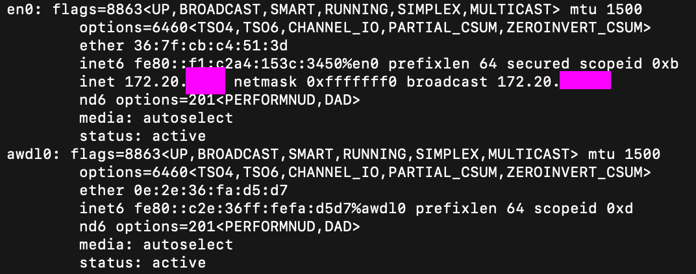

# IP Address & NAT Investigation (Hands-on Lab)

## Objective
The objective of this lab is to identify my device's private IP address, find my public IP address, compare both, and understand how Network Address Translation (NAT) works.

---

## Environment
- Device: MacBook
- OS: macOS
- Network: Wi-Fi (en0)

---

## Commands Used

### 1. Find Private IP Address
```bash
ifconfig
```
**Purpose:**
Displays network configuration details for all interfaces on the device.

**Result:**
Found under the `en0` interface (Wi-Fi):
```text
inet 172.20.xx.xx netmask 0xffffff00 broadcast 172.20.xx.xx
```
Private IP Address: **172.20.xx.xx**

---

### 2. Attempted Linux Command (Not applicable on Mac)
```bash
ip a
```
**Result:**
Command not found (Mac does not support `ip` command)

---

## Screenshots

### Private IP Address


### Public IP Address


---

## Results

| Item | Value |
|------|-------|
| Private IP Address | 172.20.xx.xx |
| Public IP Address | 102.88.xx.xx |

---

## Analysis & What I Learned
The private IP address (172.20.xx.xx) is assigned to my device within the local network. It is not accessible from the internet.

The public IP address is assigned by the Internet Service Provider (ISP) and represents my network on the internet.

This shows that my device uses different addresses for local and internet communication, and confirmed the following:
- Private IP addresses are used within local networks and are not directly reachable from the internet.
- Public IP addresses are used for communication over the internet.
- Mac uses `ifconfig` to view network interface details, including the private IP, while Linux commands like `ip a` are not available on macOS.
- Network troubleshooting depends on the operating system's specific tools and commands.

---

## NAT Explanation
Network Address Translation (NAT) is a process used by routers to translate private IP addresses into a public IP address.

This allows multiple devices on the same local network to share a single public IP address when accessing the internet.

When data is sent to the internet, the router replaces the private IP with the public IP, and routes responses back to the correct device.

---

## Conclusion
This lab helped me understand the difference between private and public IP addresses, and how NAT allows devices on a local network to share a single public IP when communicating with the internet. It also reinforced that networking commands differ across operating systems, and that troubleshooting often requires adapting to the tools available on a given system.
